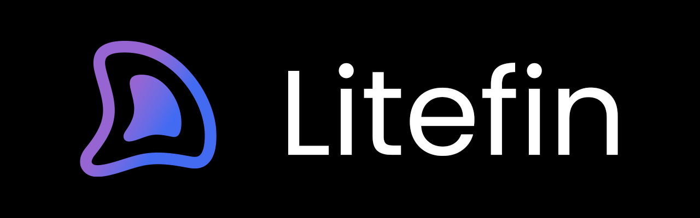

<h1 align="center">Litefin</h1>
<h3 align="center">Jellyfin & Emby Client for Smart TVs (Tizen, webOS, Android TV, Fire TV), Desktop (Windows, Linux, macOS) and Web</h3>



[](https://github.com/MoazSalem/litefin/blob/release/LICENSE)
[](https://github.com/MoazSalem/litefin/releases)
[](https://github.com/MoazSalem/litefin/releases)
[](https://discord.gg/N3VpazBtTx)
[](https://www.buymeacoffee.com/moazsalem)
[](https://github.com/MoazSalem/litefin/stargazers)

Litefin is a high-performance, open-source Jellyfin (and Emby) client engineered from scratch for Smart TVs and Desktop. Whether you're running it on Samsung Tizen, LG webOS, Android TV, Amazon Fire TV, or native Desktop (Windows, Linux, macOS), Litefin delivers a unified, zero-bloat experience with hardware-optimized playback backends, pixel-perfect subtitle rendering, and a butter-smooth interface even on legacy hardware.

Extend Litefin features by installing the **Litefin Plugin** on your [**Jellyfin**](https://github.com/MoazSalem/litefin-plugin) or [**Emby**](https://github.com/MoazSalem/litefin-plugin-emby) servers.


## Features

- **Fast Native Performance**: Built in pure vanilla JavaScript with zero heavy framework overhead, custom virtualized scrolling (`VirtualCardRow`, `VirtualGrid`), and aggressive DOM recycling tailored for low-RAM TV hardware and desktop environments.
- **Hardware-Accelerated Multi-Engine Playback**:
    - **Samsung Tizen (AVPlay)**: Native AVPlay pipeline with hardware-level buffer tuning and zero-latency seek queues.
    - **LG webOS Player**: Native webOS media pipeline with full platform lifecycle integration.
    - **Android TV & Fire TV (Media3 ExoPlayer)**: Native ExoPlayer backend with dynamic hardware codec detection (`MediaCodecList`), multichannel audio passthrough (TrueHD, DTS-HD MA, Atmos), and smart fallback for chipsets lacking AV1 hardware decoders (e.g., Amlogic S905X).
    - **Desktop (Movi & HTML5)**: High-performance WASM & WebCodecs engine (`movi-player`) alongside an optimized HTML5 video player backend with auto-failover.
- **Subtitle Engine**:
    - Full SSA/ASS styling and positioning via `@jellyfin/libass-wasm` (compiled to WebAssembly) with custom font support and low-VRAM modes.
    - Native PGS image-based subtitle decoding via `libpgs`.
    - Pure JavaScript text-based subtitle parser with granular styling overrides (color, font, size, shadows, vertical positioning, offset tuning).
    - In-player subtitle search and download directly from OpenSubtitles/Jellyfin.
- **Player Controls (OSD)**:
    - Dynamic stream quality switching, audio/subtitle track selectors with persistence across episodes.
    - Chapter navigation, playback speed (0.5x–2.0x), aspect ratio overrides, and real-time playback info (bitrates, codecs, transcode reasons).
    - Synchronized scrolling lyrics for music playback, Now Playing queue management, and interactive Up Next auto-play countdowns.
    - High-performance Trickplay thumbnail previews while seeking.
- **Unified Remote & Input Navigation**:
    - Full Samsung Smart Remote, LG Magic Remote (D-Pad & pointer), Android TV / Fire TV remotes (D-Pad, media keys, and hardware Back button interception), and Desktop keyboard / mouse controls.
- **Integrations & Plugins**:
    - **Seerr (Jellyseerr / Overseerr)**: Native discovery page, trending carousels, full search, per-season requests, and TMDB-backed "Where to Watch" streaming availability (Requires Litefin Plugin).
    - **Intro Skipper**: Automatic detection and instant skipping of TV show intros and recaps.
    - **SyncPlay**: Real-time synchronized group viewing over WebSockets.
    - **MDBList**: Multi-source community ratings (IMDb, Rotten Tomatoes, Metacritic, Trakt, TMDB, Letterboxd) directly on cards and banners.
    - **Local Intros**: Seamless playback of custom pre-roll cinema bumpers.
    - **JellyEmu**: Native retro gaming launcher and UI for emulated games.
- **TV & Desktop Interface & Theming**:
    - 6+ dynamic themes (Classic Dark/Light, True Black, Tinted Light/Dark, Ambient Glow).
    - 5 customizable sidebar styles (Classic, Modern, Collapsed Modern with tooltips, Floating Buttons, Floating Island).
    - Multiple media card & row presentations (Classic rows, Modern cards, Modern posters, Expanding posters).
    - Canvas-based BlurHash placeholder decoding for buttery-smooth image loading.
- **Comprehensive Media Support**:
    - Movies, TV Series, Music, Live TV (with full EPG grid, timer scheduling, and recording playback), Photos/Slideshows, and Multi-part media (CD1/CD2) auto-chaining.
    - Jellyfin 12 ready: supports `filters2`, multi-source trickplay streams, and modern API headers.
- **Admin Features**: Edit item images, run metadata identification, and trigger library scans directly from the remote control.
- **Multi-Tier Server Discovery**: Instant connection via webOS Luna Service, Tizen HTTP service, local subnet scanning, Quick Connect QR code, and Wake-on-LAN (WoL) cold-boot support.
- **Cross-Platform Build Pipeline & Packaging**:
    - **Smart TVs**: 4 optimized build tiers per platform (Modern, Normal, Legacy, Ultra-Legacy) supporting everything from modern 2024+ smart TVs all the way back to Tizen 2.3+ and webOS 1.0+ (Chromium 32+).
    - **Android TV & Fire TV**: Native APK packages powered by Tauri v2 and Media3 ExoPlayer.
    - **Desktop**: Native cross-platform bundles for Windows (`.exe`, `.msi`), Linux (`.deb`, `.AppImage`), and macOS (`.dmg`) built with Tauri v2.

## Documentation

Comprehensive documentation is available in the `documentations` directory:

- [**Overview**](./documentations/Overview.md): Project introduction and the 8x build strategy.
- [**Architecture**](./documentations/Architecture.md): Framework details (EventBus, FocusManager, Plugins).
- [**Plugins**](./documentations/Plugins.md): How the plugin system works and how to create them.
- [**Playback**](./documentations/Playback.md): Tizen AVPlay, web-OS adapters, and Subtitle Manager.
- [**Features**](./documentations/Features.md): Categorized list of all implemented functionality.
- [**UI & UX**](./documentations/UI_UX.md): Design system, components, and animation principles.
- [**Screenshots**](./documentations/Screenshots.md): Visual previews of the application.
- [**Development**](./documentations/Development.md): Build pipeline, variants, and deployment guide.
- [**Localization**](./documentations/Localization.md): A doc for translation contributions.

## Quick Start (Development)

```bash
# Install dependencies
npm install

# Build Smart TV web bundles (Tizen / webOS)
npm run build
npm run package

# Build and package for Desktop (Windows, Linux, macOS via Tauri)
npm run package:desktop
# Or platform-specific:
npm run package:windows
npm run package:linux
npm run package:macos

# Build and package for Android TV & Fire TV (.apk via Tauri)
npm run package:android-tv
```

## Quick Installation

### Samsung Tizen TVs

The easiest way to install on a Samsung TV is with the **Apps2Samsung** installer:

1. Download the latest `.wgt` from the [Releases](https://github.com/MoazSalem/litefin/releases) page.
2. Use [**Apps2Samsung**](https://github.com/Apps2Samsung/Apps2Samsung) to sideload the `.wgt` to your TV.
3. (Optional) Install and Configure [**Litefin Plugin**](https://github.com/MoazSalem/litefin-plugin) on your Jellyfin server.

### LG webOS TVs

Litefin can be installed on LG TVs using the **Homebrew Channel**:

1. Install the [**Homebrew Channel**](https://github.com/webosbrew/webos-homebrew-channel) on your LG TV by following the instructions in its repository.
2. Either install through the Homebrew Channel UI or download the latest `.ipk` for your hardware from the [Releases](https://github.com/MoazSalem/litefin/releases) page.
3. Open the Homebrew Channel on your TV and use the **Package Manager** to sideload the `.ipk` file.
4. (Optional) Install and Configure [**Litefin Plugin**](https://github.com/MoazSalem/litefin-plugin) on your Jellyfin server.

### Android TV & Amazon Fire TV

1. Download the latest `.apk` from the [Releases](https://github.com/MoazSalem/litefin/releases) page.
2. Sideload the `.apk` file using **adb** (`adb install litefin.apk`), **Send Files to TV (SFTV)**, **Downloader**, or your preferred file manager.
3. (Optional) Install and Configure [**Litefin Plugin**](https://github.com/MoazSalem/litefin-plugin) on your Jellyfin server.

### Desktop (Windows, Linux, macOS)

1. Download the installer or package for your OS from the [Releases](https://github.com/MoazSalem/litefin/releases) page:
    - **Windows**: `.msi` or `.exe` installer.
    - **Linux**: `.deb` package or standalone `.AppImage`.
    - **macOS**: `.dmg` disk image.
2. Install and launch Litefin on your machine.

## Support

If Litefin is useful to you, please consider supporting the development:

- [**Buy me a coffee**](https://buymeacoffee.com/moazsalem)
- [**Sponsor this project on GitHub**](https://github.com/sponsors/MoazSalem)

<p>
  A massive thank you to the individuals supporting the development of <b>LiteFin</b>!
</p>

  <table border="0">
    <tr>
     <td align="center" width="160">
        <a href="https://github.com/Saulimedes">
          
          <br />
          <b>Paul Becker</b>
        </a>
      </td>
     <td align="center" width="160">
        <a href="https://github.com/massoncl">
          
          <br />
          <b>Clément Masson</b>
        </a>
      </td>
     <td align="center" width="160">
        <a href="https://github.com/Scoty">
          
          <br />
          <b>Anton Antonov</b>
        </a>
      </td>
     <td align="center" width="160">
        <a href="https://github.com/meric426">
          
          <br />
          <b>Martin Ericson</b>
        </a>
      </td>
       <td align="center" width="160">
        <a href="https://github.com/pzmarzly">
          
          <br />
          <b>Paweł Zmarzły</b>
        </a>
      </td>
       </tr>
    <tr>
      <td align="center" width="160">
        <a href="https://github.com/witks">
          
          <br />
          <b>witek</b>
        </a>
      </td>
     <td align="center" width="160">
        <a href="https://github.com/DatAres37">
          
          <br />
          <b>DatAres37</b>
        </a>
      </td>
      <td align="center" width="160">
        <a href="https://github.com/danitesler">
          
          <br />
          <b>Dani Tesler</b>
        </a>
      </td>
      <td align="center" width="160">
        <a href="https://github.com/h3xler">
          
          <br />
          <b>h3xler</b>
        </a>
      </td>
      <td align="center" width="160">
        <a href="https://github.com/d-stl">
          
          <br />
          <b>domantas</b>
        </a>
      </td>
     </tr>
     <tr>
       <td align="center" width="160">
        <a href="https://github.com/TheColin21">
          
          <br />
          <b>Colin P</b>
        </a>
      </td>
       <td align="center" width="160">
        <a href="https://github.com/cozyportal">
          
          <br />
          <b>cozyportal</b>
        </a>
      </td>
     </tr>
    
  </table>

## License

Litefin is subject to the terms of the **Mozilla Public License, v. 2.0**. See the [LICENSE](LICENSE) file for more details.
